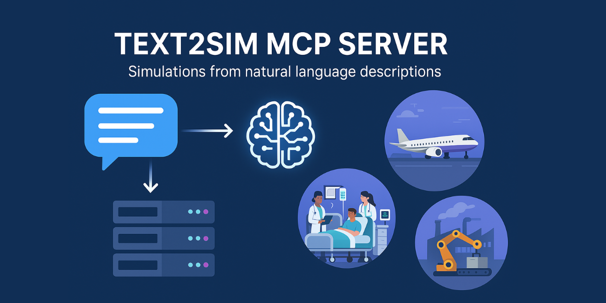

[](https://mseep.ai/app/iamcatobot-text2sim-mcp-server)



# **Text2Sim MCP Server**  
### *Multi-paradigm Simulation Engine for LLM Integration*

**Text2Sim MCP Server** is a simulation engine that supports multiple modeling paradigms, including Discrete-Event Simulation (DES) and System Dynamics (SD). It integrates with LLMs using the **Model Context Protocol (MCP)**, enabling powerful simulation capabilities within natural language environments like Claude Desktop.

[](https://www.youtube.com/watch?v=qkdV-HtTtLs "Text2Sim MCP Server (demo)")

---
## 🚀 Features

- **Large Language Model (LLM) Integration**  
  Create simulation models using plain English descriptions to LLMs.

- **Multi-Paradigm Support**  
  - **Discrete-Event Simulation (DES)** using SimPy for process-oriented models
  - **System Dynamics (SD)** using PySD for feedback-driven continuous models

- **Multi-Domain Support**  
  Build simulations for domains such as airport operations, healthcare, manufacturing, supply chains, and more.

- **Flexible Model Configuration**
  - **DES**: Configurable entities with stochastic process logic
  - **SD**: Stock-and-flow models with feedback loops and time-based equations

- **Real-Time Metrics**  
  - **DES**: Performance indicators such as wait times and throughput
  - **SD**: Time series data for stocks, flows, and auxiliaries

- **Secure Implementation**  
  Uses regex-based parsing (not `eval()`) for processing distribution inputs and safe model execution.

---

## 🔧 Installation

### **Prerequisites**
- Python **3.12** or higher
- [`uv` package manager](https://github.com/astral-sh/uv)

### **Install `uv`**

#### On macOS and Linux:
```bash
curl -LsSf https://astral.sh/uv/install.sh | sh
```

#### On Windows (PowerShell):
```powershell
powershell -ExecutionPolicy ByPass -c "irm https://astral.sh/uv/install.ps1 | iex"
```

Learn more: [astral-sh/uv](https://github.com/astral-sh/uv)

---

## 🛠️ Usage

### **Clone the repository**
```bash
git clone https://github.com/IamCatoBot/text2sim-MCP-server.git
```

### **Integration with Claude Desktop**

1. Open:
 
`Claude > Settings > Developer > Edit Config > claude_desktop_config.json`

2. Add the following block:
```json
{
  "mcpServers": {
    "Text2Sim MCP Server": {
      "command": "uv",
      "args": [
        "--directory",
        "PATH_TO_TEXT2SIM_MCP_SERVER", 
        "run",
        "mcp_server.py"
      ],
      "env": {}
    }
  }
}
```

> **Note:** If the `uv` command is not found, run `which uv` (Unix) or `Get-Command uv` (PowerShell) and use the full path in the `"command"` field.

---

## 📚 API Reference

### Overview

The MCP server provides tools for both Discrete-Event Simulation and System Dynamics modeling:

- **Discrete-Event Simulation**: Process-oriented modeling with SimPy
- **System Dynamics**: Stock-and-flow modeling with PySD

When using a Large Language Model (e.g. Claude) client, natural language prompts are translated into appropriate configurations via the **Model Context Protocol (MCP)**.

---

## 🏗️ Architecture

Text2Sim is structured into modular components:

- **MCP Server** – Handles natural language requests via MCP.
- **Discrete-Event Simulation (DES) Module**
  - **Simulation Model** – Core [SimPy](https://simpy.readthedocs.io/en/latest/) engine that executes process flows.
  - **Entity Class** – Represents units flowing through the system.
  - **Process Steps** – Encapsulate logic for each process stage.
  - **Metrics Collector** – Gathers statistics like wait times and throughput.
  - **Secure Distribution Parser** – Parses probability distributions safely.
- **System Dynamics (SD) Module**
  - **Model Registry** – Manages available SD models.
  - **PySD Integration** – Runs stock-and-flow models using PySD.
  - **Simulation Controls** – Time steps, durations, and parameter adjustments.
  - **Results Formatter** – Structures time series data for output.

For detailed documentation of each module, see:
- [DES Module Documentation](DES/README.md)
- [SD Module Documentation](SD/README.md)

---

## 🔐 Security Considerations

- **No `eval()` usage**  
  Regex-based parsing prevents arbitrary code execution.
  
- **Input Validation**  
  Distribution types, parameters, and model configurations are validated before execution.

- **Robust Error Handling**  
  Errors are reported cleanly without leaking internal state.

---

## 🤝 Contributing

Pull requests are welcome! Please fork the repo and submit a PR. Suggestions, bug reports, and feature ideas are always appreciated.

---

## 📄 License

This project is licensed under the **MIT License**. See the [LICENSE](LICENSE) file for details.